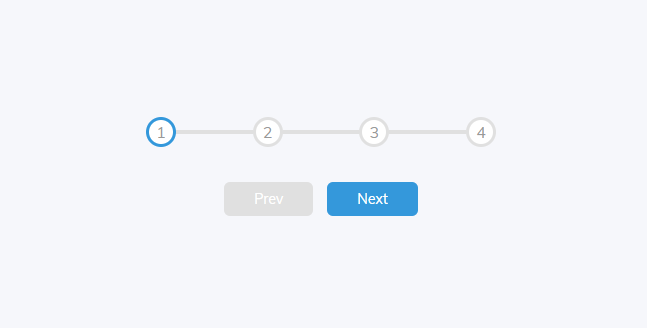

# Progress Steps

<p align="center">

</p>
In this project we display the progress bar

- with number indicator and progress line
- when next and prev button are click the indicator progresses back and forth
- limit the values within the indicator

Use of variables

```
:root {
  --line-border-fill: #3498db;
  --line-border-empty: #e0e0e0;
}

.progress{
  background-color: var(--line-border-empty);
}
```
